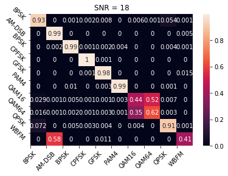
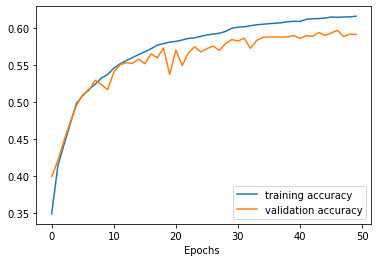
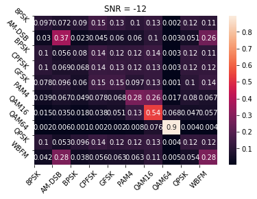
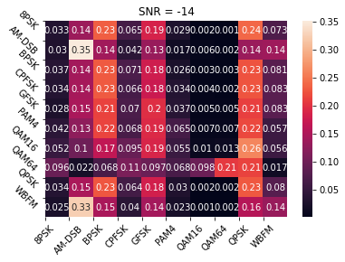
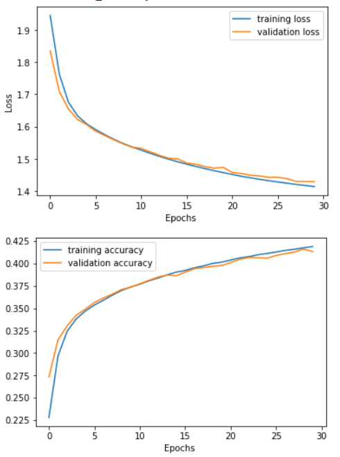
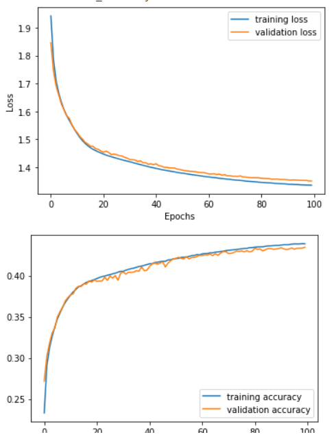
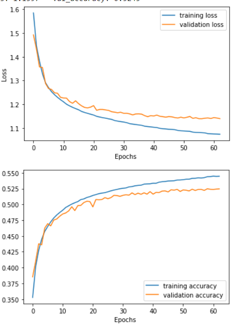

# Modlation Classification

[![GitHub][github-badge]][github]
[![Binder][binder-badge]][binder]
[![License][license-badge]][license]

- [Modlation Classification](#modlation-classification)
  - [The Dataset](#the-dataset)
  - [The Models](#the-models)
    - [Hyperparameters](#hyperparameters)
    - [CNN model](#cnn-model)
      - [Experiment 1](#experiment-1)
      - [Experiment 2](#experiment-2)
      - [Experiment 3](#experiment-3)
      - [Experiment 4](#experiment-4)
      - [Final Experiment](#final-experiment)
      - [Differentiated Signal CNN](#differentiated-signal-cnn)
      - [Integrated Signal](#integrated-signal)
      - [Combined Features](#combined-features)
      - [Embedded Features (SNR)](#embedded-features-snr)
    - [RNN model](#rnn-model)
      - [Experiment 1](#experiment-1-1)
      - [Experiment 2](#experiment-2-1)
      - [Experiment 3](#experiment-3-1)
      - [Experiment 4](#experiment-4-1)
      - [Experiment 5](#experiment-5)
      - [With First Derivative](#with-first-derivative)
      - [With Integral](#with-integral)
      - [Combination Raw and Derivative](#combination-raw-and-derivative)
      - [Combination Raw and Integral](#combination-raw-and-integral)
      - [Combination Derivative and Integral](#combination-derivative-and-integral)

## The Dataset

<!-- TODO: Talk about the dataset -->

## The Models

### Hyperparameters

| Hyperparameter | Value      |
| -------------- | ---------- |
| Early stopping | patience=5 |
| Optimizer      | Adam       |
| Max epochs     | 100        |

### CNN model

![CNN model][cnn-model]

```text
Model: "cnn_2_ch"
_________________________________________________________________
Layer (type)                 Output Shape              Param #
=================================================================
conv2d (Conv2D)              (None, 2, 128, 64)        640
_________________________________________________________________
conv2d_1 (Conv2D)            (None, 1, 64, 16)         9232
_________________________________________________________________
flatten (Flatten)            (None, 1024)              0
_________________________________________________________________
dense (Dense)                (None, 128)               131200
_________________________________________________________________
dense_1 (Dense)              (None, 11)                1419
=================================================================
Total params: 142,491
Trainable params: 142,491
Non-trainable params: 0
_________________________________________________________________
```

#### Experiment 1

Learning rate: 0.001

| Parameter           | Value  |
| ------------------- | ------ |
| Training loss       | 1.0292 |
| Training accuracy   | 0.5698 |
| Validation loss     | 1.0691 |
| Validation accuracy | 0.5485 |
| Number of epochs    | 20     |


#### Experiment 2

Learning rate: 0.003

| Parameter           | Value  |
| ------------------- | ------ |
| Training loss       | 1.1237 |
| Training accuracy   | 0.5308 |
| Validation loss     | 1.1264 |
| Validation accuracy | 0.5321 |
| Number of epochs    | 18     |


#### Experiment 3

- Learning rate scheduler: step decay
- Learning rate start: 0.003

| Parameter           | Value  |
| ------------------- | ------ |
| Training loss       | 1.0804 |
| Training accuracy   | 0.5449 |
| Validation loss     | 1.0917 |
| Validation accuracy | 0.5388 |
| Number of epochs    | 24     |


#### Experiment 4

- Learning rate scheduler: step decay
- Learning rate start: 0.0009

| Parameter           | Value  |
| ------------------- | ------ |
| Training loss       | 1.0417 |
| Training accuracy   | 0.5631 |
| Validation loss     | 1.0663 |
| Validation accuracy | 0.5519 |
| Number of epochs    | 24     |


#### Final Experiment

The hyperparameters of this experiment are then used for all CNN models.

The main difference is adding Batch Normalization.

| parameter           | value  |
| ------------------- | ------ |
| Training loss       | 0.9906 |
| Training accuracy   | 0.5909 |
| Validation loss     | 1.0766 |
| Validation accuracy | 0.5575 |
| Number of epochs    | 33     |


```text
              precision    recall  f1-score   support

        8PSK       0.57      0.54      0.55     36000
      AM-DSB       0.51      0.69      0.59     36000
        BPSK       0.55      0.65      0.59     36000
       CPFSK       0.60      0.64      0.62     36000
        GFSK       0.51      0.69      0.59     36000
        PAM4       0.77      0.70      0.73     36000
       QAM16       0.46      0.32      0.38     36000
       QAM64       0.54      0.45      0.49     36000
        QPSK       0.52      0.55      0.53     36000
        WBFM       0.50      0.31      0.38     36000

    accuracy                           0.55    360000
   macro avg       0.55      0.55      0.55    360000
weighted avg       0.55      0.55      0.55    360000
```

- accuracy at SNR = 0 is around 0.78
- most confused class: WBFM





#### Differentiated Signal CNN

| Parameter           | Value  |
| ------------------- | ------ |
| Training loss       | 1.1809 |
| Training accuracy   | 0.5176 |
| Validation loss     | 1.3008 |
| Validation accuracy | 0.4713 |
| Number of epochs    | 15     |


```text
                  precision    recall  f1-score   support

            8PSK       0.29      0.57      0.38     36000
          AM-DSB       0.44      0.75      0.55     36000
            BPSK       0.60      0.56      0.58     36000
           CPFSK       0.52      0.63      0.57     36000
            GFSK       0.62      0.65      0.63     36000
            PAM4       0.80      0.47      0.59     36000
           QAM16       0.31      0.07      0.12     36000
           QAM64       0.48      0.58      0.53     36000
            QPSK       0.52      0.38      0.44     36000
            WBFM       0.64      0.22      0.33     36000

        accuracy                           0.49    360000
       macro avg       0.52      0.49      0.47    360000
    weighted avg       0.52      0.49      0.47    360000
```

- accuracy at SNR = 0 is around 0.65
- Most confused class: QAM16


#### Integrated Signal

| Parameter           | Value  |
| ------------------- | ------ |
| Training loss       | 0.9085 |
| Training accuracy   | 0.6154 |
| Validation loss     | 0.9752 |
| Validation accuracy | 0.5907 |
| Number of epochs    | 50     |




```text
                  precision    recall  f1-score   support

            8PSK       0.58      0.52      0.55     36000
          AM-DSB       0.47      0.61      0.53     36000
            BPSK       0.77      0.65      0.70     36000
           CPFSK       0.74      0.62      0.68     36000
            GFSK       0.71      0.67      0.69     36000
            PAM4       0.80      0.73      0.76     36000
           QAM16       0.41      0.53      0.46     36000
           QAM64       0.47      0.65      0.55     36000
            QPSK       0.65      0.53      0.58     36000
            WBFM       0.54      0.43      0.48     36000

        accuracy                           0.59    360000
       macro avg       0.61      0.59      0.60    360000
    weighted avg       0.61      0.59      0.60    360000

```

- accuracy at SNR = 0 is around 0.77
- Most confused class: QAM16


Accuracy at SNR = -10 is 0.4000000059604645 %



Accuracy at SNR = -12 is 0.28999999165534973 %


Accuracy at SNR = -14 is 0.2199999988079071 %


Accuracy at SNR = -16 is 0.15000000596046448 %


Accuracy at SNR = -18 is 0.11999999731779099 %


Accuracy at SNR = -2 is 0.7300000190734863 %


Accuracy at SNR = -20 is 0.10999999940395355 %


Accuracy at SNR = -4 is 0.6899999976158142 %


Accuracy at SNR = -6 is 0.6100000143051147 %


Accuracy at SNR = -8 is 0.5099999904632568 %


Accuracy at SNR = 0 is 0.7699999809265137 %


Accuracy at SNR = 10 is 0.8199999928474426 %


Accuracy at SNR = 12 is 0.8199999928474426 %


Accuracy at SNR = 14 is 0.8199999928474426 %


Accuracy at SNR = 16 is 0.8199999928474426 %


Accuracy at SNR = 18 is 0.8100000023841858 %


Accuracy at SNR = 2 is 0.7900000214576721 %


Accuracy at SNR = 4 is 0.800000011920929 %


Accuracy at SNR = 6 is 0.8100000023841858 %


Accuracy at SNR = 8 is 0.8100000023841858 %


#### Combined Features

| Parameter           | Value  |
| ------------------- | ------ |
| Training loss       | 0.9299 |
| Training accuracy   | 0.6202 |
| Validation loss     | 1.0782 |
| Validation accuracy | 0.5641 |
| Number of epochs    | 16     |


```text

            8PSK       0.70      0.52      0.60     36000
          AM-DSB       0.47      0.75      0.58     36000
            BPSK       0.54      0.67      0.60     36000
           CPFSK       0.74      0.64      0.68     36000
            GFSK       0.57      0.71      0.63     36000
            PAM4       0.82      0.71      0.76     36000
           QAM16       0.59      0.48      0.53     36000
           QAM64       0.64      0.51      0.56     36000
            QPSK       0.47      0.59      0.52     36000
            WBFM       0.51      0.29      0.37     36000

        accuracy                           0.59    360000
       macro avg       0.60      0.59      0.58    360000
    weighted avg       0.60      0.59      0.58    360000


```

- Most confused class: QPSK
- Accuracy at SNR = 0 is 0.81





#### Embedded Features (SNR)

| Parameter           | Value  |
| ------------------- | ------ |
| Training loss       | 0.8305 |
| Training accuracy   | 0.6567 |
| Validation loss     | 0.9309 |
| Validation accuracy | 0.6185 |
| Number of epochs    | 15     |


```text
                  precision    recall  f1-score   support

            8PSK       0.62      0.52      0.57     36000
          AM-DSB       0.48      0.77      0.59     36000
            BPSK       0.58      0.71      0.64     36000
           CPFSK       0.79      0.65      0.71     36000
            GFSK       0.81      0.65      0.72     36000
            PAM4       0.87      0.74      0.80     36000
           QAM16       0.60      0.57      0.58     36000
           QAM64       0.51      0.82      0.63     36000
            QPSK       0.66      0.56      0.61     36000
            WBFM       0.60      0.29      0.39     36000

        accuracy                           0.63    360000
       macro avg       0.65      0.63      0.62    360000
    weighted avg       0.65      0.63      0.62    360000


```

- Most confused class: AM-DSB, WBFM
- Accuracy at SNR = 0 is 0.89


### RNN model

```text
_________________________________________________________________
Layer (type)                 Output Shape              Param #
=================================================================
simple_rnn_2 (SimpleRNN)     (None, 2, 128)            32896
_________________________________________________________________
simple_rnn_3 (SimpleRNN)     (None, 64)                12352
_________________________________________________________________
dense_1 (Dense)              (None, 10)                650
=================================================================
Total params: 45,898
Trainable params: 45,898
Non-trainable params: 0
_________________________________________________________________
```

#### Experiment 1

Learning rate: 0.001

| Parameter           | Value  |
| ------------------- | ------ |
| Training loss       | 1.1983 |
| Training accuracy   | 0.4975 |
| Validation loss     | 1.2184 |
| Validation accuracy | 0.4925 |
| Number of epochs    | 25     |


#### Experiment 2

Learning rate: 0.0001

| Parameter           | Value  |
| ------------------- | ------ |
| Training loss       | 1.4268 |
| Training accuracy   | 0.4152 |
| Validation loss     | 1.4482 |
| Validation accuracy | 0.4085 |
| Number of epochs    | 30     |



#### Experiment 3

- Learning rate scheduler: step decay
- Learning rate start: 0.001

| Parameter           | Value  |
| ------------------- | ------ |
| Training loss       | 1.2141 |
| Training accuracy   | 0.4769 |
| Validation loss     | 1.2154 |
| Validation accuracy | 0.4698 |
| Number of epochs    | 35     |


#### Experiment 4

- Learning rate scheduler: step decay
- Learning rate start: 0.0001

| Parameter           | Value  |
| ------------------- | ------ |
| Training loss       | 1.3328 |
| Training accuracy   | 0.4421 |
| Validation loss     | 1.3417 |
| Validation accuracy | 0.4375 |
| Number of epochs    | 100    |



#### Experiment 5

- Learning rate scheduler: step decay
- Learning rate start: 0.0009

| Parameter           | Value  |
| ------------------- | ------ |
| Training loss       | 1.0742 |
| Training accuracy   | 0.5445 |
| Validation loss     | 1.1397 |
| Validation accuracy | 0.5245 |
| Number of epochs    | 63     |




#### With First Derivative

- Learning rate scheduler: step decay
- Learning rate start: 0.0008

| Parameter           | Value  |
| ------------------- | ------ |
| Training loss       | 1.3695 |
| Training accuracy   | 0.4134 |
| Validation loss     | 1.4149 |
| Validation accuracy | 0.5245 |
| Test accuracy       | 0.4013 |
| Number of epochs    | 55     |


#### With Integral

- Learning rate scheduler: step decay
- Learning rate start: 0.0009

| Parameter           | Value  |
| ------------------- | ------ |
| Training loss       | 1.1069 |
| Training accuracy   | 0.5341 |
| Validation loss     | 1.1392 |
| Validation accuracy | 0.5242 |
| Test accuracy       | 0.5242 |
| Number of epochs    | 80     |


#### Combination Raw and Derivative

- Learning rate scheduler: step decay
- Learning rate start: 0.0009

| Parameter           | Value  |
| ------------------- | ------ |
| Training loss       | 1.0770 |
| Training accuracy   | 0.5427 |
| Validation loss     | 1.1412 |
| Validation accuracy | 0.5255 |
| Test accuracy       | 0.5237 |
| Number of epochs    | 57     |


#### Combination Raw and Integral

- Learning rate scheduler: step decay
- Learning rate start: 0.0009

| Parameter           | Value  |
| ------------------- | ------ |
| Training loss       | 1.1493 |
| Training accuracy   | 0.5151 |
| Validation loss     | 1.1694 |
| Validation accuracy | 0.5106 |
| Test accuracy       | 0.5103 |
| Number of epochs    | 34     |


#### Combination Derivative and Integral

- Learning rate scheduler: step decay
- Learning rate start: 0.0009

| Parameter           | Value  |
| ------------------- | ------ |
| Training loss       | 1.1084 |
| Training accuracy   | 0.5318 |
| Validation loss     | 1.1370 |
| Validation accuracy | 0.5273 |
| Test accuracy       | 0.5281 |
| Number of epochs    | 65     |


<!-- References -->
[github]: github.com/moharamfatema/modulation-classification
[github-badge]: https://img.shields.io/badge/GitHub-100000?style=for-the-badge&logo=github&logoColor=white

[license]: https://github.com/moharamfatema/modulation-classification/blob/main/COPYING

[license-badge]: https://img.shields.io/badge/License-GPLv3-blue?style=for-the-badge

[binder-badge]: https://img.shields.io/badge/launch-binder-orange.svg?style=for-the-badge

[binder]: https://mybinder.org/v2/gh/moharamfatema/modulation-classification/main

[cnn-model]: https://github.com/moharamfatema/modulation-classification/blob/main/docs/img/cnn-model.png
