# 1. Modulation Classification

[![GitHub][github-badge]][github]
[![Binder][binder-badge]][binder]
[![License][license-badge]][license]

- [1. Modulation Classification](#1-modulation-classification)
  - [1.1. The Dataset](#11-the-dataset)
    - [1.1.1. Reading the dataset](#111-reading-the-dataset)
    - [1.1.2. Exploring the dataset](#112-exploring-the-dataset)
    - [1.1.3. Splitting the dataset](#113-splitting-the-dataset)
    - [1.1.4. Feature spaces](#114-feature-spaces)
      - [1.1.4.1. Preprocessing](#1141-preprocessing)
  - [1.2. The Models](#12-the-models)
    - [1.2.1. Hyperparameters](#121-hyperparameters)
    - [1.2.2. CNN model](#122-cnn-model)
      - [1.2.2.1. Experiment 1](#1221-experiment-1)
      - [1.2.2.2. Experiment 2](#1222-experiment-2)
      - [1.2.2.3. Experiment 3](#1223-experiment-3)
      - [1.2.2.4. Experiment 4](#1224-experiment-4)
      - [1.2.2.5. Final Experiment](#1225-final-experiment)
      - [1.2.2.6. Differentiated Signal CNN](#1226-differentiated-signal-cnn)
      - [1.2.2.7. Integrated Signal](#1227-integrated-signal)
      - [1.2.2.8. Combined Features](#1228-combined-features)
      - [1.2.2.9. Embedded Features (SNR)](#1229-embedded-features-snr)
    - [1.2.3. RNN model](#123-rnn-model)
      - [1.2.3.1. Experiment 1](#1231-experiment-1)
      - [1.2.3.2. Experiment 2](#1232-experiment-2)
      - [1.2.3.3. Experiment 3](#1233-experiment-3)
      - [1.2.3.4. Experiment 4](#1234-experiment-4)
      - [1.2.3.5. Experiment 5](#1235-experiment-5)
      - [1.2.3.6. With First Derivative](#1236-with-first-derivative)
      - [1.2.3.7. With Integral](#1237-with-integral)
      - [1.2.3.8. Combination Raw and Derivative](#1238-combination-raw-and-derivative)
      - [1.2.3.9. Combination Raw and Integral](#1239-combination-raw-and-integral)
      - [1.2.3.10. Combination Derivative and Integral](#12310-combination-derivative-and-integral)
    - [1.2.4. LSTM model](#124-lstm-model)
      - [1.2.4.1. Experiment 1](#1241-experiment-1)
      - [1.2.4.2. Experiment 2](#1242-experiment-2)
      - [1.2.4.3. Experiment 3 (final version)](#1243-experiment-3-final-version)
      - [1.2.4.4. With First Derivative](#1244-with-first-derivative)
      - [1.2.4.5. With Integral](#1245-with-integral)
      - [1.2.4.6. Combination Raw and Derivative](#1246-combination-raw-and-derivative)
      - [1.2.4.7. Combination Raw and Integral](#1247-combination-raw-and-integral)
      - [1.2.4.8. Combination Derivative and Integral](#1248-combination-derivative-and-integral)
    - [1.2.5. Transformer Encoder Model](#125-transformer-encoder-model)
      - [1.2.5.1. Hyperparameters](#1251-hyperparameters)
      - [1.2.5.2. Combination Raw and Derivative](#1252-combination-raw-and-derivative)
      - [1.2.5.3. Embedding (SNR)](#1253-embedding-snr)

## 1.1. The Dataset

The RadioML 2016.10 is a dataset of modulated radio signals. The dataset contains 10 different modulations: 8PSK, AM-DSB , BPSK, CPFSK, GFSK, PAM4, QAM16, QAM64, QPSK, and WBFM.

### 1.1.1. Reading the dataset

```python
# from https://github.com/radioML/examples/blob/master/modulation_recognition/RML2016.10a_VTCNN2_example.ipynb
# modified for python 3
Xd = pickle.load(open(DAT, 'rb'), encoding='latin1')
snrs,mods = map(lambda j: sorted(list(set(map(lambda x: x[j], Xd.keys())))), [1,0])
X = []
lbl = []
for mod in mods:
    for snr in snrs:
        X.append(Xd[(mod,snr)])
        for i in range(Xd[(mod,snr)].shape[0]):  lbl.append((mod,snr))
del Xd, snrs, mods
X = np.vstack(X)
X = np.moveaxis(X, 1, -1)
X = X / np.max(X)
y = np.array(lbl)
del lbl
gc.collect()
X.shape, y.shape
```

### 1.1.2. Exploring the dataset

```python
# The labels
print(f'{np.unique(y[:,0],return_counts=True)}\n\n\
{np.unique(y[:,1],return_counts=True)}')
```

```python
plt.plot(X[0,:,0])
plt.plot(X[0,:,1])
plt.title(f'{y[0,0]} , {y[0,1]}')
plt.show()
```

The dataset contains 1 200 000 samples. Each sample is a 2-channel signal with 128 samples per channel.

An example of a 2-channel signal:


The dataset contains 120 000 samples per modulation.

The dataset contains 20 SNR levels. Each SNR level contains 60 000 samples per modulation.

### 1.1.3. Splitting the dataset

```python
def split(x,y):
    x_train, x_test, y_train, y_test = train_test_split(x, y, test_size = 0.3, random_state =1, stratify = y[:,0])
    x_train, x_val, y_train, y_val = train_test_split(x_train, y_train, test_size = 0.05, random_state =1, stratify = y_train[:,0])
    return x_train, x_val, x_test, y_train, y_val, y_test
```

The dataset is split into 3 subsets: training, validation, and testing.

Test set is 30 %. The remaining 70 % is split into training and validation sets. The training set is 95 % of the remaining 70 %, and the validation set is 5 % of the remaining 70 %.

### 1.1.4. Feature spaces

Possible feature spaces:

1. raw signal
2. derivative
3. integration
4. raw and derivative
5. raw and integration
6. derivative and integration
7. raw and derivative and integration

```python
X_diff = np.gradient(X,axis=-1)
X_int = np.zeros_like(X)
X_int[:,:,:-1] = np.array(cumulative_trapezoid(X))

X_raw_diff = np.concatenate((X,X_diff),axis=1)
X_raw_int = np.concatenate((X,X_int),axis=1)
X_diff_int = np.concatenate((X_diff,X_int),axis=1)

X_all = np.concatenate((X,X_diff,X_int),axis=1)
```

An example of a differentiated signal:

```python
d_np = np.gradient(X[0,:,0])

lines=[d_np,X[0,:,0]]

t = np.linspace(0,127,128)

fig = go.Figure()
fig.add_trace(go.Line(x=t,y=lines[0],name=f'derivative'))
fig.add_trace(go.Line(x=t,y=lines[1],name=f'original signal'))

fig.show()
```

 

An example of an integrated signal:

```python
i_ct = cumulative_trapezoid(X[0,:,0])

lines=[i_ct,X[0,:,0]]

t = np.linspace(0,127,128)

fig = go.Figure()
fig.add_trace(go.Line(x=t,y=lines[0],name=f'cumulative trapezoid'))

fig.add_trace(go.Line(x=t,y=lines[1],name=f'original signal'))

fig.show()
```

  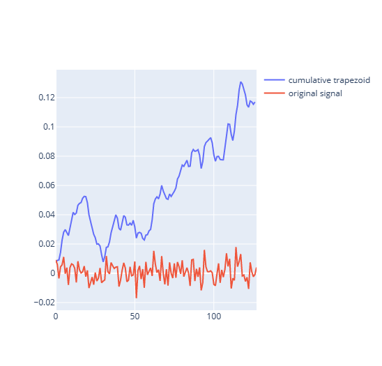

#### 1.1.4.1. Preprocessing

The labels are one-hot encoded.

```python
encoder = OneHotEncoder(sparse=False)
encoder.fit(y_test[:,0].reshape(-1,1))
y_test_encoded = encoder.transform(y_test[:,0].reshape(-1,1))
y_train_encoded = encoder.transform(y_train[:,0].reshape(-1,1))
y_val_encoded = encoder.transform(y_val[:,0].reshape(-1,1))
```

## 1.2. The Models

Learning rate scheduler and checkpoints are configured.

```python
values = np.linspace(0.00001,LEARNING_RATE,10)[::-1]
boundaries = np.linspace(5, 100,9)[:values.shape[0]-1].astype(np.int32)

scheduler = keras.optimizers.schedules.PiecewiseConstantDecay(
    list(boundaries), list(values))

lr_scheduler = tf.keras.callbacks.LearningRateScheduler(scheduler,verbose=1)

early_stopping = keras.callbacks.EarlyStopping(monitor='val_loss', patience = PATIENCE, mode='min')

def configure_checkpoints(path):
    return keras.callbacks.ModelCheckpoint(
        filepath=path,
        save_weights_only=True,
        monitor='val_loss',
        mode='min',
        save_best_only=True)
```

The training process is configured with early stopping.

```python
def train_and_plot(model,checkpoint_path,x_train,y_train,x_val,y_val,epochs=EPOCHS,batch_size=512):
    checkpoint = configure_checkpoints(checkpoint_path)
    history=model.fit(
        x=x_train,
        y=y_train,
        batch_size=batch_size,
        epochs=epochs,
        validation_data=(x_val,y_val),
        callbacks=[lr_scheduler,checkpoint,early_stopping]
    )

    num=len(history.history['loss'])

    plt.plot(range(num),history.history['loss'],label = 'training loss')
    plt.plot(range(num),history.history['val_loss'],label = 'validation loss')

    plt.legend()

    plt.xlabel("Epochs ")
    plt.ylabel('Loss')

    plt.figure()

    plt.plot(range(num),history.history['accuracy'],label = 'training accuracy')
    plt.plot(range(num),history.history['val_accuracy'],label = 'validation accuracy')

    plt.legend()
    plt.xlabel("Epochs ")
    return history
```

The evaluation process is configured.

```python
def eval_model(model,x,y,y_encoded):
    y_pred = model.predict(x.reshape(x.shape+(1,)))
    y_pred = np.argmax(y_pred,axis = -1)
    y_numbers = np.argmax(y_encoded,axis=-1)

    target_names = np.unique(y[:,0])
    labels = target_names
    tick_marks = np.arange(len(labels))

    print(classification_report(y_numbers, y_pred, target_names=target_names))

    cm = tf.math.confusion_matrix(y_numbers,y_pred).numpy().astype(np.int64)
    cm = np.around(cm.astype('float') / cm.sum(axis=1)[:, np.newaxis], decimals=3)
    sns.heatmap(cm,annot=True)
    plt.xticks(tick_marks, labels, rotation= 45)
    plt.yticks(tick_marks, labels, rotation=-45)

    plt.figure()
    snrs = np.unique(y[:,1])

    accuracies = np.zeros_like(snrs,dtype=np.float32)
    for i, snr in enumerate(snrs):
        idx = y[:,1] == snr
        cm = tf.math.confusion_matrix(y_numbers[idx],y_pred[idx]).numpy().astype(np.int64)
        cm = np.around(cm.astype('float') / cm.sum(axis=1)[:, np.newaxis], decimals=3)

        sns.heatmap(cm,annot=True)
        plt.title(f"SNR = {snr}")
        plt.xticks(tick_marks, labels, rotation= 45)
        plt.yticks(tick_marks, labels, rotation=-45)
        plt.show()
        plt.figure()
        accuracies[i] = np.count_nonzero(y_numbers[idx] == y_pred[idx]) / y_pred[idx].shape[0]

    plt.plot(snrs,np.around(accuracies * 100,2))
    plt.xlabel('SNR')
    plt.ylabel("Accuracy")
    plt.show()
```

### 1.2.1. Hyperparameters

| Hyperparameter | Value      |
| -------------- | ---------- |
| Early stopping | patience=5 |
| Optimizer      | Adam       |
| Max epochs     | 100        |

### 1.2.2. CNN model

```python
EPOCHS = 100
PATIENCE = 6
LEARNING_RATE = 0.0009

X = X[:,:,np.newaxis,:]
```

The data is reshaped to fit the CNN model.

```python
def create_cnn(name,cnn_input_shape):
    cnn_model = keras.Sequential([
        layers.Conv2D(64,
                    kernel_size=3,
                    activation='relu',
                      padding='same',
                    input_shape=cnn_input_shape),
        layers.BatchNormalization(), # This was added later
        layers.Conv2D(16,
                     kernel_size=3,
                      strides=2,
                      padding='same',
                     activation='relu'),
        layers.BatchNormalization(),  # This was added later
        layers.Flatten(),
        layers.Dense(128,activation='relu'),
        layers.Dense(10,activation='softmax'),
    ],name=name)

    optimizer = keras.optimizers.Adam(learning_rate=LEARNING_RATE)
    loss = keras.losses.CategoricalCrossentropy()
    cnn_model.compile(optimizer=optimizer,loss=loss,metrics=['accuracy'])

    print(cnn_model.summary())
    return cnn_model
```

![CNN model][cnn-model]

```text
Model: "cnn_2_ch"
_________________________________________________________________
Layer (type)                 Output Shape              Param #
=================================================================
conv2d (Conv2D)              (None, 2, 128, 64)        640
_________________________________________________________________
conv2d_1 (Conv2D)            (None, 1, 64, 16)         9232
_________________________________________________________________
flatten (Flatten)            (None, 1024)              0
_________________________________________________________________
dense (Dense)                (None, 128)               131200
_________________________________________________________________
dense_1 (Dense)              (None, 11)                1419
=================================================================
Total params: 142,491
Trainable params: 142,491
Non-trainable params: 0
_________________________________________________________________
```

#### 1.2.2.1. Experiment 1

Learning rate: 0.001

| Parameter           | Value  |
| ------------------- | ------ |
| Training loss       | 1.0292 |
| Training accuracy   | 0.5698 |
| Validation loss     | 1.0691 |
| Validation accuracy | 0.5485 |
| Number of epochs    | 20     |


#### 1.2.2.2. Experiment 2

Learning rate: 0.003

| Parameter           | Value  |
| ------------------- | ------ |
| Training loss       | 1.1237 |
| Training accuracy   | 0.5308 |
| Validation loss     | 1.1264 |
| Validation accuracy | 0.5321 |
| Number of epochs    | 18     |


#### 1.2.2.3. Experiment 3

- Learning rate scheduler: step decay
- Learning rate start: 0.003

| Parameter           | Value  |
| ------------------- | ------ |
| Training loss       | 1.0804 |
| Training accuracy   | 0.5449 |
| Validation loss     | 1.0917 |
| Validation accuracy | 0.5388 |
| Number of epochs    | 24     |


#### 1.2.2.4. Experiment 4

- Learning rate scheduler: step decay
- Learning rate start: 0.0009

| Parameter           | Value  |
| ------------------- | ------ |
| Training loss       | 1.0417 |
| Training accuracy   | 0.5631 |
| Validation loss     | 1.0663 |
| Validation accuracy | 0.5519 |
| Number of epochs    | 24     |


#### 1.2.2.5. Final Experiment

The hyperparameters of this experiment are then used for all CNN models.

The main difference is adding Batch Normalization.

| parameter           | value  |
| ------------------- | ------ |
| Training loss       | 0.9906 |
| Training accuracy   | 0.5909 |
| Validation loss     | 1.0766 |
| Validation accuracy | 0.5575 |
| Number of epochs    | 33     |


```text
              precision    recall  f1-score   support

        8PSK       0.57      0.54      0.55     36000
      AM-DSB       0.51      0.69      0.59     36000
        BPSK       0.55      0.65      0.59     36000
       CPFSK       0.60      0.64      0.62     36000
        GFSK       0.51      0.69      0.59     36000
        PAM4       0.77      0.70      0.73     36000
       QAM16       0.46      0.32      0.38     36000
       QAM64       0.54      0.45      0.49     36000
        QPSK       0.52      0.55      0.53     36000
        WBFM       0.50      0.31      0.38     36000

    accuracy                           0.55    360000
   macro avg       0.55      0.55      0.55    360000
weighted avg       0.55      0.55      0.55    360000
```

- accuracy at SNR = 0 is around 0.78
- most confused class: WBFM


#### 1.2.2.6. Differentiated Signal CNN

```python
x = np.gradient(X,axis=-1)
cnn_diff_model = create_cnn("cnn_diff",x.shape[1:])
```

| Parameter           | Value  |
| ------------------- | ------ |
| Training loss       | 1.1809 |
| Training accuracy   | 0.5176 |
| Validation loss     | 1.3008 |
| Validation accuracy | 0.4713 |
| Number of epochs    | 15     |


```text
                  precision    recall  f1-score   support

            8PSK       0.29      0.57      0.38     36000
          AM-DSB       0.44      0.75      0.55     36000
            BPSK       0.60      0.56      0.58     36000
           CPFSK       0.52      0.63      0.57     36000
            GFSK       0.62      0.65      0.63     36000
            PAM4       0.80      0.47      0.59     36000
           QAM16       0.31      0.07      0.12     36000
           QAM64       0.48      0.58      0.53     36000
            QPSK       0.52      0.38      0.44     36000
            WBFM       0.64      0.22      0.33     36000

        accuracy                           0.49    360000
       macro avg       0.52      0.49      0.47    360000
    weighted avg       0.52      0.49      0.47    360000
```

- accuracy at SNR = 0 is around 0.65
- Most confused class: QAM16


#### 1.2.2.7. Integrated Signal

```python
x = np.zeros_like(X)
x[:,:-1,:,:] = cumulative_trapezoid(X,axis=1)
SNR = np.array(y[:,1]).astype(int)[:,np.newaxis,np.newaxis,np.newaxis].repeat(2,axis=-1)
x = np.concatenate((x,SNR),axis=1)
x.shape
```

| Parameter           | Value  |
| ------------------- | ------ |
| Training loss       | 0.9085 |
| Training accuracy   | 0.6154 |
| Validation loss     | 0.9752 |
| Validation accuracy | 0.5907 |
| Number of epochs    | 50     |


```text
                  precision    recall  f1-score   support

            8PSK       0.58      0.52      0.55     36000
          AM-DSB       0.47      0.61      0.53     36000
            BPSK       0.77      0.65      0.70     36000
           CPFSK       0.74      0.62      0.68     36000
            GFSK       0.71      0.67      0.69     36000
            PAM4       0.80      0.73      0.76     36000
           QAM16       0.41      0.53      0.46     36000
           QAM64       0.47      0.65      0.55     36000
            QPSK       0.65      0.53      0.58     36000
            WBFM       0.54      0.43      0.48     36000

        accuracy                           0.59    360000
       macro avg       0.61      0.59      0.60    360000
    weighted avg       0.61      0.59      0.60    360000

```

- accuracy at SNR = 0 is around 0.77
- Most confused class: QAM16


Accuracy at SNR = -10 is 0.4000000059604645 %


Accuracy at SNR = -12 is 0.28999999165534973 %


Accuracy at SNR = -14 is 0.2199999988079071 %


Accuracy at SNR = -16 is 0.15000000596046448 %


Accuracy at SNR = -18 is 0.11999999731779099 %

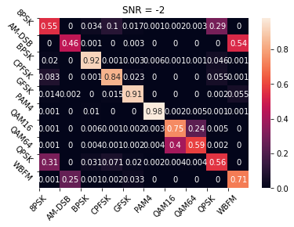

Accuracy at SNR = -2 is 0.7300000190734863 %


Accuracy at SNR = -20 is 0.10999999940395355 %


Accuracy at SNR = -4 is 0.6899999976158142 %


Accuracy at SNR = -6 is 0.6100000143051147 %


Accuracy at SNR = -8 is 0.5099999904632568 %


Accuracy at SNR = 0 is 0.7699999809265137 %


Accuracy at SNR = 10 is 0.8199999928474426 %


Accuracy at SNR = 12 is 0.8199999928474426 %


Accuracy at SNR = 14 is 0.8199999928474426 %


Accuracy at SNR = 16 is 0.8199999928474426 %


Accuracy at SNR = 18 is 0.8100000023841858 %


Accuracy at SNR = 2 is 0.7900000214576721 %


Accuracy at SNR = 4 is 0.800000011920929 %


Accuracy at SNR = 6 is 0.8100000023841858 %


Accuracy at SNR = 8 is 0.8100000023841858 %


#### 1.2.2.8. Combined Features

```python
x_diff = np.gradient(X,axis=-1)
x_int = np.zeros_like(X)
x_int[:,:,:-1] = np.array(cumulative_trapezoid(X))

x = np.concatenate((X,x_diff,x_int),axis=1)
```

| Parameter           | Value  |
| ------------------- | ------ |
| Training loss       | 0.9299 |
| Training accuracy   | 0.6202 |
| Validation loss     | 1.0782 |
| Validation accuracy | 0.5641 |
| Number of epochs    | 16     |


```text

            8PSK       0.70      0.52      0.60     36000
          AM-DSB       0.47      0.75      0.58     36000
            BPSK       0.54      0.67      0.60     36000
           CPFSK       0.74      0.64      0.68     36000
            GFSK       0.57      0.71      0.63     36000
            PAM4       0.82      0.71      0.76     36000
           QAM16       0.59      0.48      0.53     36000
           QAM64       0.64      0.51      0.56     36000
            QPSK       0.47      0.59      0.52     36000
            WBFM       0.51      0.29      0.37     36000

        accuracy                           0.59    360000
       macro avg       0.60      0.59      0.58    360000
    weighted avg       0.60      0.59      0.58    360000


```

- Most confused class: QPSK
- Accuracy at SNR = 0 is 0.81


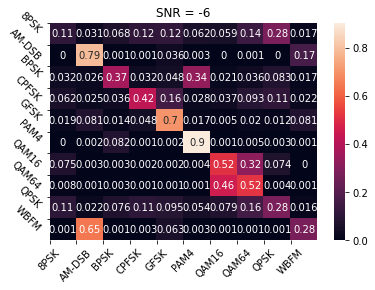


#### 1.2.2.9. Embedded Features (SNR)

```python
SNR = np.array(y[:,1]).astype(int)[:,np.newaxis,np.newaxis,np.newaxis].repeat(2,axis=-1)
X_embed = np.concatenate((X,SNR),axis=1)
X_embed.shape
```

| Parameter           | Value  |
| ------------------- | ------ |
| Training loss       | 0.8305 |
| Training accuracy   | 0.6567 |
| Validation loss     | 0.9309 |
| Validation accuracy | 0.6185 |
| Number of epochs    | 15     |


```text
                  precision    recall  f1-score   support

            8PSK       0.62      0.52      0.57     36000
          AM-DSB       0.48      0.77      0.59     36000
            BPSK       0.58      0.71      0.64     36000
           CPFSK       0.79      0.65      0.71     36000
            GFSK       0.81      0.65      0.72     36000
            PAM4       0.87      0.74      0.80     36000
           QAM16       0.60      0.57      0.58     36000
           QAM64       0.51      0.82      0.63     36000
            QPSK       0.66      0.56      0.61     36000
            WBFM       0.60      0.29      0.39     36000

        accuracy                           0.63    360000
       macro avg       0.65      0.63      0.62    360000
    weighted avg       0.65      0.63      0.62    360000


```

- Most confused class: AM-DSB, WBFM
- Accuracy at SNR = 0 is 0.89


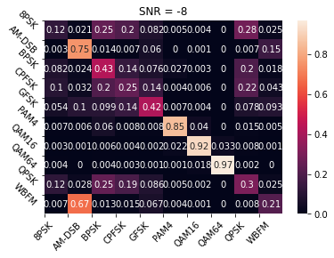


### 1.2.3. RNN model

```text
_________________________________________________________________
Layer (type)                 Output Shape              Param #
=================================================================
simple_rnn_2 (SimpleRNN)     (None, 2, 128)            32896
_________________________________________________________________
simple_rnn_3 (SimpleRNN)     (None, 64)                12352
_________________________________________________________________
dense_1 (Dense)              (None, 10)                650
=================================================================
Total params: 45,898
Trainable params: 45,898
Non-trainable params: 0
_________________________________________________________________
```

#### 1.2.3.1. Experiment 1

Learning rate: 0.001

| Parameter           | Value  |
| ------------------- | ------ |
| Training loss       | 1.1983 |
| Training accuracy   | 0.4975 |
| Validation loss     | 1.2184 |
| Validation accuracy | 0.4925 |
| Number of epochs    | 25     |


#### 1.2.3.2. Experiment 2

Learning rate: 0.0001

| Parameter           | Value  |
| ------------------- | ------ |
| Training loss       | 1.4268 |
| Training accuracy   | 0.4152 |
| Validation loss     | 1.4482 |
| Validation accuracy | 0.4085 |
| Number of epochs    | 30     |


#### 1.2.3.3. Experiment 3

- Learning rate scheduler: step decay
- Learning rate start: 0.001

| Parameter           | Value  |
| ------------------- | ------ |
| Training loss       | 1.2141 |
| Training accuracy   | 0.4769 |
| Validation loss     | 1.2154 |
| Validation accuracy | 0.4698 |
| Number of epochs    | 35     |


#### 1.2.3.4. Experiment 4

- Learning rate scheduler: step decay
- Learning rate start: 0.0001

| Parameter           | Value  |
| ------------------- | ------ |
| Training loss       | 1.3328 |
| Training accuracy   | 0.4421 |
| Validation loss     | 1.3417 |
| Validation accuracy | 0.4375 |
| Number of epochs    | 100    |


#### 1.2.3.5. Experiment 5

- Learning rate scheduler: step decay
- Learning rate start: 0.0009

| Parameter           | Value  |
| ------------------- | ------ |
| Training loss       | 1.0742 |
| Training accuracy   | 0.5445 |
| Validation loss     | 1.1397 |
| Validation accuracy | 0.5245 |
| Test accuracy       | 0.5238 |
| Number of epochs    | 63     |


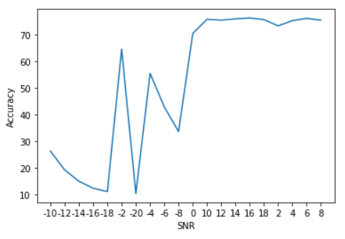

```text
              precision    recall  f1-score   support

        8PSK       0.42      0.38      0.40     36000
      AM-DSB       0.51      0.71      0.60     36000
        BPSK       0.48      0.67      0.56     36000
       CPFSK       0.67      0.62      0.64     36000
        GFSK       0.64      0.71      0.67     36000
        PAM4       0.74      0.68      0.71     36000
       QAM16       0.41      0.30      0.34     36000
       QAM64       0.53      0.41      0.46     36000
        QPSK       0.34      0.41      0.37     36000
        WBFM       0.49      0.33      0.39     36000

    accuracy                           0.52    360000
   macro avg       0.52      0.52      0.51    360000
weighted avg       0.52      0.52      0.51    360000
```

- Most confused class: AM-DSB, WBFM
- Accuracy at SNR = 0 is 0.71


#### 1.2.3.6. With First Derivative

- Learning rate scheduler: step decay
- Learning rate start: 0.0008

| Parameter           | Value  |
| ------------------- | ------ |
| Training loss       | 1.3695 |
| Training accuracy   | 0.4134 |
| Validation loss     | 1.4149 |
| Validation accuracy | 0.5245 |
| Test accuracy       | 0.4013 |
| Number of epochs    | 55     |


```text
              precision    recall  f1-score   support

        8PSK       0.20      0.14      0.16     36000
      AM-DSB       0.36      0.69      0.47     36000
        BPSK       0.45      0.35      0.40     36000
       CPFSK       0.50      0.62      0.56     36000
        GFSK       0.57      0.64      0.60     36000
        PAM4       0.57      0.52      0.54     36000
       QAM16       0.25      0.06      0.10     36000
       QAM64       0.36      0.46      0.40     36000
        QPSK       0.21      0.25      0.23     36000
        WBFM       0.41      0.28      0.33     36000

    accuracy                           0.40    360000
   macro avg       0.39      0.40      0.38    360000
weighted avg       0.39      0.40      0.38    360000
```

- Most confused class: AM-DSB, WBFM and QAM16, QAM64
- Accuracy at SNR = 0 is 0.55


#### 1.2.3.7. With Integral

- Learning rate scheduler: step decay
- Learning rate start: 0.0009

| Parameter           | Value  |
| ------------------- | ------ |
| Training loss       | 1.1069 |
| Training accuracy   | 0.5341 |
| Validation loss     | 1.1392 |
| Validation accuracy | 0.5242 |
| Test accuracy       | 0.5242 |
| Number of epochs    | 80     |


```text
              precision    recall  f1-score   support

        8PSK       0.37      0.41      0.39     36000
      AM-DSB       0.49      0.77      0.60     36000
        BPSK       0.54      0.64      0.59     36000
       CPFSK       0.66      0.62      0.64     36000
        GFSK       0.67      0.70      0.68     36000
        PAM4       0.76      0.68      0.72     36000
       QAM16       0.42      0.14      0.21     36000
       QAM64       0.51      0.51      0.51     36000
        QPSK       0.32      0.47      0.38     36000
        WBFM       0.63      0.27      0.38     36000

    accuracy                           0.52    360000
   macro avg       0.54      0.52      0.51    360000
weighted avg       0.54      0.52      0.51    360000
```

- Most confused class: QPSK
- Accuracy at SNR = 0 is 0.70


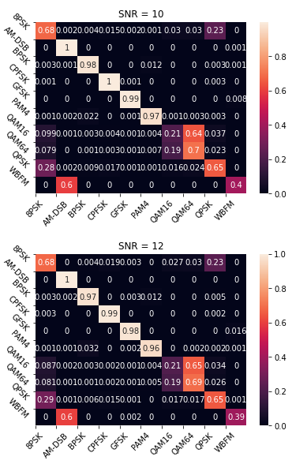


#### 1.2.3.8. Combination Raw and Derivative

- Learning rate scheduler: step decay
- Learning rate start: 0.0009

| Parameter           | Value  |
| ------------------- | ------ |
| Training loss       | 1.0770 |
| Training accuracy   | 0.5427 |
| Validation loss     | 1.1412 |
| Validation accuracy | 0.5255 |
| Test accuracy       | 0.5237 |
| Number of epochs    | 57     |


```text
              precision    recall  f1-score   support

        8PSK       0.29      0.48      0.36     36000
      AM-DSB       0.47      0.72      0.57     36000
        BPSK       0.49      0.65      0.56     36000
       CPFSK       0.71      0.61      0.66     36000
        GFSK       0.61      0.71      0.65     36000
        PAM4       0.80      0.68      0.74     36000
       QAM16       0.40      0.30      0.34     36000
       QAM64       0.52      0.42      0.46     36000
        QPSK       0.52      0.32      0.40     36000
        WBFM       0.67      0.32      0.43     36000

    accuracy                           0.52    360000
   macro avg       0.55      0.52      0.52    360000
weighted avg       0.55      0.52      0.52    360000
```

- Most confused class: AM-DSB, WBFM
- Accuracy at SNR = 0 is 0.71


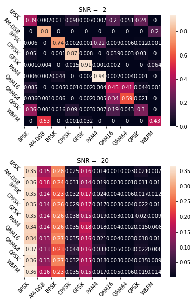


#### 1.2.3.9. Combination Raw and Integral

- Learning rate scheduler: step decay
- Learning rate start: 0.0009

| Parameter           | Value  |
| ------------------- | ------ |
| Training loss       | 1.1493 |
| Training accuracy   | 0.5151 |
| Validation loss     | 1.1694 |
| Validation accuracy | 0.5106 |
| Test accuracy       | 0.5103 |
| Number of epochs    | 34     |


```text
              precision    recall  f1-score   support

        8PSK       0.37      0.34      0.35     36000
      AM-DSB       0.47      0.79      0.59     36000
        BPSK       0.66      0.59      0.63     36000
       CPFSK       0.67      0.61      0.64     36000
        GFSK       0.71      0.69      0.70     36000
        PAM4       0.83      0.64      0.72     36000
       QAM16       0.41      0.15      0.22     36000
       QAM64       0.51      0.45      0.48     36000
        QPSK       0.24      0.53      0.33     36000
        WBFM       0.73      0.26      0.38     36000

    accuracy                           0.51    360000
   macro avg       0.56      0.51      0.50    360000
weighted avg       0.56      0.51      0.50    360000
```

- Most confused class: QPSK
- Accuracy at SNR = 0 is 0.70

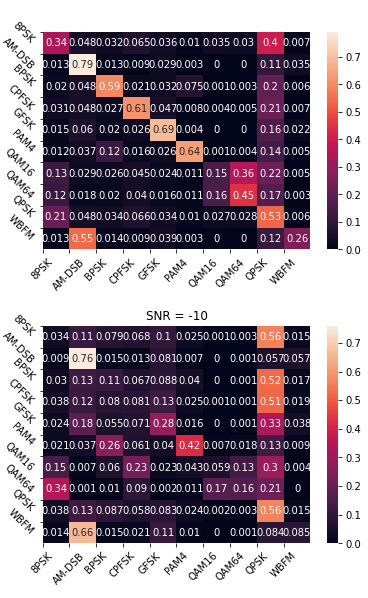


#### 1.2.3.10. Combination Derivative and Integral

- Learning rate scheduler: step decay
- Learning rate start: 0.0009

| Parameter           | Value  |
| ------------------- | ------ |
| Training loss       | 1.1084 |
| Training accuracy   | 0.5318 |
| Validation loss     | 1.1370 |
| Validation accuracy | 0.5273 |
| Test accuracy       | 0.5281 |
| Number of epochs    | 65     |


```text
              precision    recall  f1-score   support

        8PSK       0.33      0.44      0.37     36000
      AM-DSB       0.51      0.65      0.57     36000
        BPSK       0.54      0.64      0.59     36000
       CPFSK       0.73      0.59      0.65     36000
        GFSK       0.54      0.74      0.62     36000
        PAM4       0.82      0.67      0.74     36000
       QAM16       0.34      0.14      0.20     36000
       QAM64       0.51      0.55      0.53     36000
        QPSK       0.52      0.38      0.44     36000
        WBFM       0.42      0.41      0.42     36000

    accuracy                           0.52    360000
   macro avg       0.53      0.52      0.51    360000
weighted avg       0.53      0.52      0.51    360000
```

- Most confused class: QAM16, QAM64
- Accuracy at SNR = 0 is 0.73


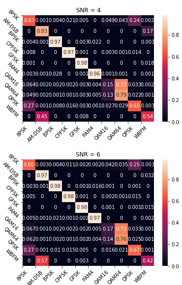


### 1.2.4. LSTM model

#### 1.2.4.1. Experiment 1

```text
_________________________________________________________________
Layer (type)                 Output Shape              Param #
=================================================================
lstm_1 (LSTM)                (None, 22)                13288
_________________________________________________________________
dense_3 (Dense)              (None, 10)                230
=================================================================
Total params: 13,518
Trainable params: 13,518
Non-trainable params: 0
_________________________________________________________________
```

Learning rate scheduler: step decay
Learning rate: 0.0009

| Parameter           | Value  |
| ------------------- | ------ |
| Training loss       | 1.487  |
| Training accuracy   | 0.389  |
| Validation loss     | 1.4979 |
| Validation accuracy | 0.3837 |
| Number of epochs    | 100    |


#### 1.2.4.2. Experiment 2

```text
_________________________________________________________________
Layer (type)                 Output Shape              Param #
=================================================================
lstm (LSTM)                  (None, 128)               131584
_________________________________________________________________
dense (Dense)                (None, 64)                8256
_________________________________________________________________
dense_1 (Dense)              (None, 32)                2080
_________________________________________________________________
dropout (Dropout)            (None, 32)                0
_________________________________________________________________
dense_2 (Dense)              (None, 10)                330
=================================================================
Total params: 142,250
Trainable params: 142,250
Non-trainable params: 0
_________________________________________________________________

```

Learning rate scheduler: step decay
Learning rate: 0.0001

| Parameter           | Value  |
| ------------------- | ------ |
| Training loss       | 1.1282 |
| Training accuracy   | 0.5082 |
| Validation loss     | 1.1718 |
| Validation accuracy | 0.4999 |
| Number of epochs    | 100    |


#### 1.2.4.3. Experiment 3 (final version)

```text
Model: "sequential"
_________________________________________________________________
Layer (type)                 Output Shape              Param #
=================================================================
lstm (LSTM)                  (None, 256)               394240
_________________________________________________________________
dense (Dense)                (None, 128)               32896
_________________________________________________________________
dense_1 (Dense)              (None, 64)                8256
_________________________________________________________________
dense_2 (Dense)              (None, 32)                2080
_________________________________________________________________
dropout (Dropout)            (None, 32)                0
_________________________________________________________________
dense_3 (Dense)              (None, 10)                330
=================================================================
Total params: 437,802
Trainable params: 437,802
Non-trainable params: 0
_________________________________________________________________
```

- Learning rate scheduler: step decay
- Learning rate start: 0.0009

| Parameter           | Value  |
| ------------------- | ------ |
| Training loss       | 1.0844 |
| Training accuracy   | 0.5291 |
| Validation loss     | 1.3189 |
| Validation accuracy | 0.5200 |
| Number of epochs    | 100    |


```text
 precision    recall  f1-score   support

        8PSK       0.32      0.45      0.37     36000
      AM-DSB       0.47      0.79      0.59     36000
        BPSK       0.42      0.73      0.53     36000
       CPFSK       0.69      0.62      0.65     36000
        GFSK       0.75      0.68      0.72     36000
        PAM4       0.86      0.64      0.73     36000
       QAM16       0.42      0.29      0.34     36000
       QAM64       0.57      0.40      0.47     36000
        QPSK       0.34      0.31      0.32     36000
        WBFM       0.83      0.26      0.40     36000

    accuracy                           0.52    360000
   macro avg       0.57      0.52      0.51    360000
weighted avg       0.57      0.52      0.51    360000
```

- Most confused class: 8PSK,QPSK
- Accuracy at SNR = 0 is 0.5180


#### 1.2.4.4. With First Derivative

- Learning rate scheduler: step decay
- Learning rate start: 0.0009
-first experiment architechture was used

| Parameter           | Value  |
| ------------------- | ------ |
| Training loss       | 1.7470 |
| Training accuracy   | 0.3135 |
| Validation loss     | 1.7604 |
| Validation accuracy | 0.3085 |
| Test accuracy       | 0.31   |
| Number of epochs    | 100    |


```text
          precision    recall  f1-score   support

        8PSK       0.15      0.07      0.09     36000
      AM-DSB       0.36      0.50      0.42     36000
        BPSK       0.15      0.14      0.14     36000
       CPFSK       0.32      0.59      0.41     36000
        GFSK       0.38      0.63      0.47     36000
        PAM4       0.47      0.46      0.46     36000
       QAM16       0.22      0.04      0.07     36000
       QAM64       0.26      0.51      0.34     36000
        QPSK       0.17      0.03      0.05     36000
        WBFM       0.29      0.13      0.18     36000

    accuracy                           0.31    360000
   macro avg       0.28      0.31      0.27    360000
weighted avg       0.28      0.31      0.27    360000
```

- Most confused class: 8PSK,QPSK
- Accuracy at SNR = 0 is 0.3963


#### 1.2.4.5. With Integral

- Learning rate scheduler: step decay
- Learning rate start: 0.0009
- second experiment was used

| Parameter           | Value  |
| ------------------- | ------ |
| Training loss       | 1.0711 |
| Training accuracy   | 0.5427 |
| Validation loss     | 1.1411 |
| Validation accuracy | 0.5288 |
| Test accuracy       | 0.53   |
| Number of epochs    | 100    |


```text
precision    recall  f1-score   support

        8PSK       0.26      0.52      0.35     36000
      AM-DSB       0.47      0.80      0.59     36000
        BPSK       0.57      0.65      0.60     36000
       CPFSK       0.66      0.62      0.64     36000
        GFSK       0.69      0.70      0.70     36000
        PAM4       0.85      0.67      0.75     36000
       QAM16       0.34      0.13      0.19     36000
       QAM64       0.53      0.57      0.55     36000
        QPSK       0.51      0.37      0.43     36000
        WBFM       0.85      0.25      0.39     36000

    accuracy                           0.53    360000
   macro avg       0.57      0.53      0.52    360000
weighted avg       0.57      0.53      0.52    360000
```

- Most confused class: 8PSK
- Accuracy at SNR = 0 is 0.5230


#### 1.2.4.6. Combination Raw and Derivative

- Learning rate scheduler: step decay
- Learning rate start: 0.0009

| Parameter           | Value  |
| ------------------- | ------ |
| Training loss       | 0.9455 |
| Training accuracy   | 0.5914 |
| Validation loss     | 1.5697 |
| Validation accuracy | 0.5253 |
| Test accuracy       | 0.58   |
| Number of epochs    | 100    |


```text
           precision    recall  f1-score   support

        8PSK       0.29      0.45      0.35     36000
      AM-DSB       0.46      0.80      0.58     36000
        BPSK       0.51      0.64      0.57     36000
       CPFSK       0.63      0.62      0.63     36000
        GFSK       0.75      0.67      0.71     36000
        PAM4       0.83      0.67      0.74     36000
       QAM16       0.39      0.26      0.31     36000
       QAM64       0.54      0.44      0.48     36000
        QPSK       0.43      0.42      0.43     36000
        WBFM       0.83      0.26      0.40     36000

    accuracy                           0.58    360000
   macro avg       0.57      0.52      0.58    360000
weighted avg       0.57      0.52      0.57    360000
```

- Most confused class: 8PSK
- Accuracy at SNR = 0 is 0.5170


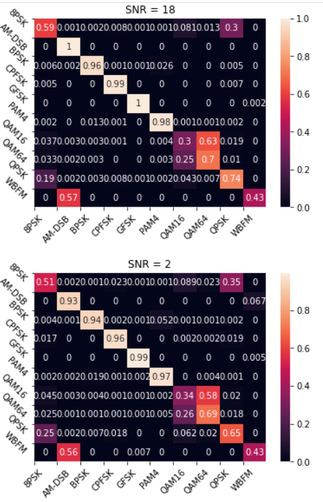


#### 1.2.4.7. Combination Raw and Integral

- Learning rate scheduler: step decay
- Learning rate start: 0.0009

| Parameter           | Value  |
| ------------------- | ------ |
| Training loss       | 0.8854 |
| Training accuracy   | 0.6175 |
| Validation loss     | 2.4617 |
| Validation accuracy | 0.5198 |
| Test accuracy       | 0.52   |
| Number of epochs    | 100    |


```text
          precision    recall  f1-score   support

        8PSK       0.26      0.51      0.35     36000
      AM-DSB       0.46      0.80      0.58     36000
        BPSK       0.59      0.62      0.60     36000
       CPFSK       0.70      0.58      0.63     36000
        GFSK       0.67      0.69      0.68     36000
        PAM4       0.81      0.66      0.73     36000
       QAM16       0.39      0.26      0.31     36000
       QAM64       0.48      0.41      0.44     36000
        QPSK       0.50      0.37      0.42     36000
        WBFM       0.80      0.26      0.39     36000

    accuracy                           0.52    360000
   macro avg       0.57      0.52      0.51    360000
weighted avg       0.57      0.52      0.51    360000
```

- Most confused class: 8PSK
- Accuracy at SNR = 0 is 0.468


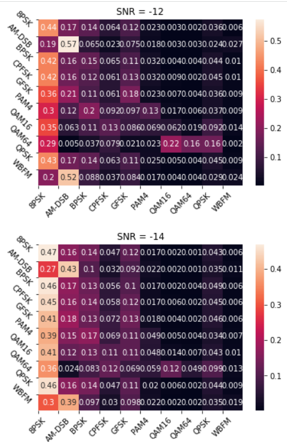


#### 1.2.4.8. Combination Derivative and Integral

- Learning rate scheduler: step decay
- Learning rate start: 0.0009

| Parameter           | Value  |
| ------------------- | ------ |
| Training loss       | 0.9326 |
| Training accuracy   | 0.6006 |
| Validation loss     | 1.8830 |
| Validation accuracy | 0.5185 |
| Test accuracy       | 0.52   |
| Number of epochs    | 100    |


```text
          precision    recall  f1-score   support

        8PSK       0.26      0.51      0.35     36000
      AM-DSB       0.46      0.80      0.58     36000
        BPSK       0.59d      0.62      0.60     36000
       CPFSK       0.70      0.58      0.63     36000
        GFSK       0.67      0.69      0.68     36000
        PAM4       0.81      0.66      0.73     36000
       QAM16       0.39      0.26      0.31     36000
       QAM64       0.48      0.41      0.44     36000
        QPSK       0.50      0.37      0.42     36000
        WBFM       0.80      0.26      0.39     36000

    accuracy                           0.52    360000
   macro avg       0.57      0.52      0.51    360000
weighted avg       0.57      0.52      0.51    360000
```

- Most confused class: 8PSK
- Accuracy at SNR = 0 is 0.52


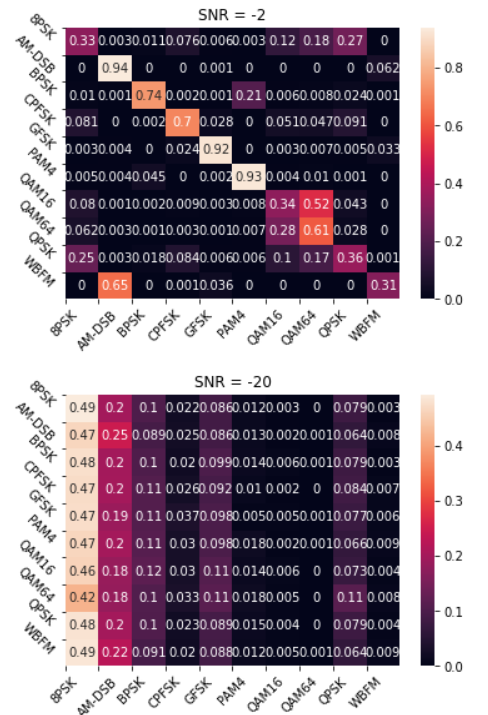


### 1.2.5. Transformer Encoder Model

Model

```text
    Model: "model"
    __________________________________________________________________________________________________
     Layer (type)                   Output Shape         Param #     Connected to
    ==================================================================================================
     input_1 (InputLayer)           [(None, 4, 128)]     0           []

     transformer_encoder (Transform  (None, 4, 128)      83136       ['input_1[0][0]',
     erEncoder)                                                       'layer_normalization[0][0]',
                                                                      'layer_normalization_1[0][0]',
                                                                      'layer_normalization_2[0][0]']

     layer_normalization (LayerNorm  (None, 4, 128)      256         ['transformer_encoder[0][0]']
     alization)

     layer_normalization_1 (LayerNo  (None, 4, 128)      256         ['transformer_encoder[1][0]']
     rmalization)

     layer_normalization_2 (LayerNo  (None, 4, 128)      256         ['transformer_encoder[2][0]']
     rmalization)

     layer_normalization_3 (LayerNo  (None, 4, 128)      256         ['transformer_encoder[3][0]']
     rmalization)

     flatten (Flatten)              (None, 512)          0           ['layer_normalization_3[0][0]']

     dense (Dense)                  (None, 10)           5130        ['flatten[0][0]']

    ==================================================================================================
    Total params: 89,290
    Trainable params: 89,290
    Non-trainable params: 0
    __________________________________________________________________________________________________
```

#### 1.2.5.1. Hyperparameters

- Learning rate scheduler: step decay
- Start learning rate: 0.0009

#### 1.2.5.2. Combination Raw and Derivative

| Parameter           | Value  |
| ------------------- | ------ |
| Training loss       | 1.1417 |
| Training accuracy   | 0.5133 |
| Validation loss     | 1.1846 |
| Validation accuracy | 0.4961 |
| Epochs              | 25     |


```text
                  precision    recall  f1-score   support

            8PSK       0.31      0.32      0.32     36000
          AM-DSB       0.42      0.77      0.54     36000
            BPSK       0.41      0.70      0.52     36000
           CPFSK       0.75      0.60      0.67     36000
            GFSK       0.70      0.68      0.69     36000
            PAM4       0.86      0.61      0.71     36000
           QAM16       0.36      0.18      0.24     36000
           QAM64       0.52      0.45      0.49     36000
            QPSK       0.33      0.36      0.34     36000
            WBFM       0.58      0.28      0.37     36000

        accuracy                           0.49    360000
       macro avg       0.52      0.49      0.49    360000
    weighted avg       0.52      0.49      0.49    360000

```

- Most confused classes: 8PSK and WBFM
- Accuracy at SNR = 0 : 69%


Accuracy at SNR = -10 is 0.2199999988079071 %


Accuracy at SNR = -12 is 0.1599999964237213 %


Accuracy at SNR = -14 is 0.11999999731779099 %


Accuracy at SNR = -16 is 0.10999999940395355 %


Accuracy at SNR = -18 is 0.10999999940395355 %


Accuracy at SNR = -2 is 0.6399999856948853 %


Accuracy at SNR = -20 is 0.10000000149011612 %


Accuracy at SNR = -4 is 0.5299999713897705 %


Accuracy at SNR = -6 is 0.4099999964237213 %


Accuracy at SNR = -8 is 0.3100000023841858 %


Accuracy at SNR = 0 is 0.6899999976158142 %


Accuracy at SNR = 10 is 0.7200000286102295 %


Accuracy at SNR = 12 is 0.7200000286102295 %


Accuracy at SNR = 14 is 0.7200000286102295 %


Accuracy at SNR = 16 is 0.7200000286102295 %


Accuracy at SNR = 18 is 0.7200000286102295 %


Accuracy at SNR = 2 is 0.7099999785423279 %


Accuracy at SNR = 4 is 0.7200000286102295 %


Accuracy at SNR = 6 is 0.7300000190734863 %


Accuracy at SNR = 8 is 0.7200000286102295 %


#### 1.2.5.3. Embedding (SNR)

| Parameter           | Value  |
| ------------------- | ------ |
| Training Loss       | 0.9943 |
| Validation Loss     | 1.0397 |
| Training Accuracy   | 0.5706 |
| Validation Accuracy | 0.5492 |
| Epochs              | 54     |


```text
                  precision    recall  f1-score   support

            8PSK       0.36      0.36      0.36     36000
          AM-DSB       0.56      0.64      0.59     36000
            BPSK       0.88      0.62      0.73     36000
           CPFSK       0.57      0.68      0.62     36000
            GFSK       0.75      0.69      0.72     36000
            PAM4       0.58      0.78      0.66     36000
           QAM16       0.42      0.45      0.43     36000
           QAM64       0.50      0.68      0.57     36000
            QPSK       0.47      0.29      0.36     36000
            WBFM       0.57      0.37      0.45     36000

        accuracy                           0.56    360000
       macro avg       0.56      0.56      0.55    360000
    weighted avg       0.56      0.56      0.55    360000
```

- Most confused classes: 8PSK and QAM16
- Accuracy at SNR = 0 : 73.56%


Accuracy at SNR = -10 is 41.85 %


Accuracy at SNR = -12 is 30.06 %


Accuracy at SNR = -14 is 22.73 %


Accuracy at SNR = -16 is 16.61 %

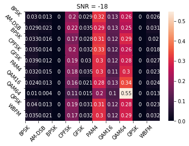

Accuracy at SNR = -18 is 12.79 %


Accuracy at SNR = -2 is 73.27 %


Accuracy at SNR = -20 is 10.92 %


Accuracy at SNR = -4 is 70.44 %


Accuracy at SNR = -6 is 63.14 %


Accuracy at SNR = -8 is 53.69 %


Accuracy at SNR = 0 is 73.56 %


Accuracy at SNR = 10 is 70.9 %


Accuracy at SNR = 12 is 70.78 %


Accuracy at SNR = 14 is 70.94 %


Accuracy at SNR = 16 is 70.44 %


Accuracy at SNR = 18 is 70.32 %


Accuracy at SNR = 2 is 72.87 %


Accuracy at SNR = 4 is 72.55 %


Accuracy at SNR = 6 is 71.69 %


Accuracy at SNR = 8 is 70.82 %


<!-- References -->
[github]: github.com/moharamfatema/modulation-classification
[github-badge]: https://img.shields.io/badge/GitHub-100000?style=for-the-badge&logo=github&logoColor=white

[license]: https://github.com/moharamfatema/modulation-classification/blob/main/COPYING

[license-badge]: https://img.shields.io/badge/License-GPLv3-blue?style=for-the-badge

[binder-badge]: https://img.shields.io/badge/launch-binder-orange.svg?style=for-the-badge

[binder]: https://mybinder.org/v2/gh/moharamfatema/modulation-classification/main

[cnn-model]: https://github.com/moharamfatema/modulation-classification/blob/main/docs/img/cnn-model.png
